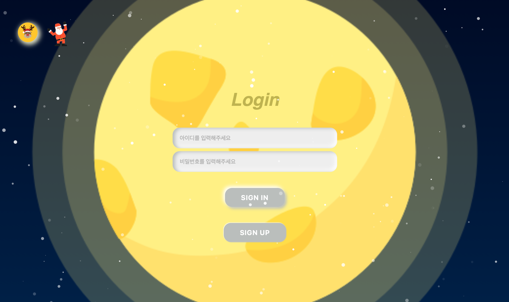

# 동행트립


<br/>

## 프로젝트 진행 기간

```
2023.11.01 ~ 2023.11.24 (약 3주)
```

<br/>

## ❤ 팀 소개

### 팀명

> 📢 안녕하세요! 설렘 가득한 여행 계획을 세우기를 바라는 취지로, 아동친화적인 여행 웹 사이트 서비스 프로젝트를 진행한 팀 《동행트립》 입니다.

### 팀원 소개

### 🌷 Frontend

<!-- <table style="width: 300px; text-align: center;"> -->
  <tr>
    <td style="padding: 8px; text-align: center;">
      <div style="display: inline-block;">
        
        <br/>
        <strong>강대은</strong>
      </div>
    </td>
  </tr>
<!-- </table> -->

<br />

### 🍚 Backend

<tr>
 <td style="padding: 8px; text-align: center;">
      <div style="display: inline-block;">
        
        <br/>
        <strong>김진우</strong>
      </div>
    </td>
</tr>

<br/>
<br/>

## 🎉 프로젝트 요약

### 💡프로젝트 명: 동행트립

### 목적

동행트립은 여행을 떠나는 설렘이 어린아이의 마음과 같은 동심과 비슷하다고 생각하여 시작하게 된 프로젝트로, 아이가 있는 가족이 이용하기 편리한 여행 계획을 세울 수 있도록 공공데이터를 기반으로 한 아동친화적인 UX/UI로 여행 정보 제공 웹 서비스를 지원합니다.

1. 관광지 정보 제공
   - 트리 위 전구(시즌별 상이) 17개 시도 선택으로, 각 도시별 관광지 리스트를 제공합니다.
   - 직관적이고 사용하기 쉬운 인터페이스를 제공하여, 사용자가 쉽게 찾을 수 있도록 검색 기능을 제공합니다.
2. 편지 작성 기능
   - 전체 게시글, 개인 쪽지 중 선택을 가능하게 하여, 메세지를 전달할 수 있도록 하였습니다.
   - 편지작성 시 10가지 종류의 랜덤 나뭇잎이 생성되어 발송하고, 게시글 모아보기 및 선택 삭제 기능을 제공합니다.
3. 이벤트 타이머 및 찜 기능
   - 시즌별로 이벤트가 생기는 날을 기준으로 타이머 기능이 작동되며, 시즌별 애니메이션 이벤트를 제공합니다.
   - 관광지 찜 등록과 삭제가 가능하도록 하며, 찜 목록 모아보기 기능을 제공합니다.

### 기대효과

- 아동친화적인 UI: 아이가 있는 가족을 대상으로 하여 아동친화적인 UX/UI를 제공하여 사용자가 보다 쉽게 이용할 수 있도록 하였습니다.
- 보안: 로그인 시 JWT기능 구현으로 보안을 강화했습니다.
- 정확한 정보 제공: 공공데이터 기반 음식, 축제, 어린이와 함께하면 좋을 관광지를 제공하며, 선택한 관광지에 대한 상세 내용 맞춤 정보를 제공해줍니다.

### 차별점

- **아동친화적인 UI로 가족중심 여행정보 제공**: 아이가 있는 가족을 대상으로 아동친화적인 UI를 제공하며, 맞춤형 정보와 이벤트성 기능을 한 곳에서 편리하게 누릴 수 있습니다.

<br/>

## ✨주요 기능 및 구현

### 💡 관광지 정보 제공:

- **17개 도시 관광지 정보제공:** 트리 위 전구(시즌별 상이) 17개 시도 선택으로, 각 도시별 관광지 리스트를 제공합니다.
- **관광지 상세정보** : 원하는 관광지를 클릭하면 관광지에 대한 상세내용을 확인할 수 있으며, 찜하기 기능을 통해 원하는 관광지를 별도로 보관할 수 있습니다.

### 💡 우체통 편지 작성 및 조회 기능:

- **전체 보기:** 모든 이용자를 대상으로하여 전체 게시판의 기능으로 누구나 게시글을 열람할 수 있습니다.
- **개인 보기:** 특정 사람에게 편지를 보낼 수 있는 기능으로, 특정인을 대상으로 1:1로 편지를 주고 받을 수 있습니다.
- **편리함 관리:** 자신이 보낸 편지와 받은 편지 목록을 조회할 수 있으며, 특정 편지를 선택하여 삭제할 수 있습니다.

### 💡 이벤트 타이머 및 찜 기능

- **이벤트 타이머**: 관리자가 설정한 날짜를 기준으로 하여 시즌별로 이벤트가 열리며, 이를 기준으로 타이머를 확인할 수 있습니다.
- **관광지 찜 리스트**: 관광지에서 찜해놓은 관광지 리스트를 별도로 확인할 수 있으며, 찜에서 삭제할 수 있습니다.

### 💡 마이페이지

- **개인정보 확인 :** 회원가입 기준으로 자신의 개인정보 확인 및 변경할 수 있습니다. 변경 시 비밀번호를 입력하여 일치할 시에 변경 가능하도록 보안을 추가하였습니다.

<br/>

## 👩🏼‍💻 담당 역할

### 강대은 - Frontend

- 팀장
- Vue.js를 기반한 프론트 구축
- 웹 사이트 기획
- UX/UI 디자인 및 페이지 개발

### 김진우 - Frontend

- Spring Boot를 이용한 백엔드 구축
- 공공데이터 파싱
- DB 구축

<br />

## 🖥 서비스 화면

<details>
<summary><h4 style="display:inline; margin-left:4px">회원가입, 로그인 페이지</h4></summary>





</details>

<details>
<summary><h4 style="display:inline; margin-left:4px">메인 페이지</h4></summary>

</details>

<details>
<summary><h4 style="display:inline; margin-left:4px">관광지 페이지</h4></summary>


</details>

<details>
<summary><h4 style="display:inline; margin-left:4px">관광지 찜 페이지</h4></summary>

</details>

<details>
<summary><h4 style="display:inline; margin-left:4px">우체통 편지전달 페이지</h4></summary>


</details>

<details>
<summary><h4 style="display:inline; margin-left:4px">마이페이지</h4></summary>

</details>

---

## 🛠 기술 스택

<div align="center">
   <div><strong>Frontend</strong> </div>
  
  
  
  
  <br/>
  <br/>
  <br/>
   <!-- 백엔드 -->
  <div><strong>Backend</strong> </div>
  
  
  
  <br/>
  <br/>

</div>

<br/>

## 📝 설계 문서

### 🏗️ ERD


<br />
